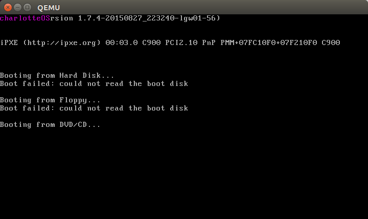

# charlotteOS - A Hobby OS

A Hobby Operating System (OS) built with Assembly & [Rust](https://www.rust-lang.org).

Created by following along with the [intermezzOS book](http://intermezzos.github.io/book/)

